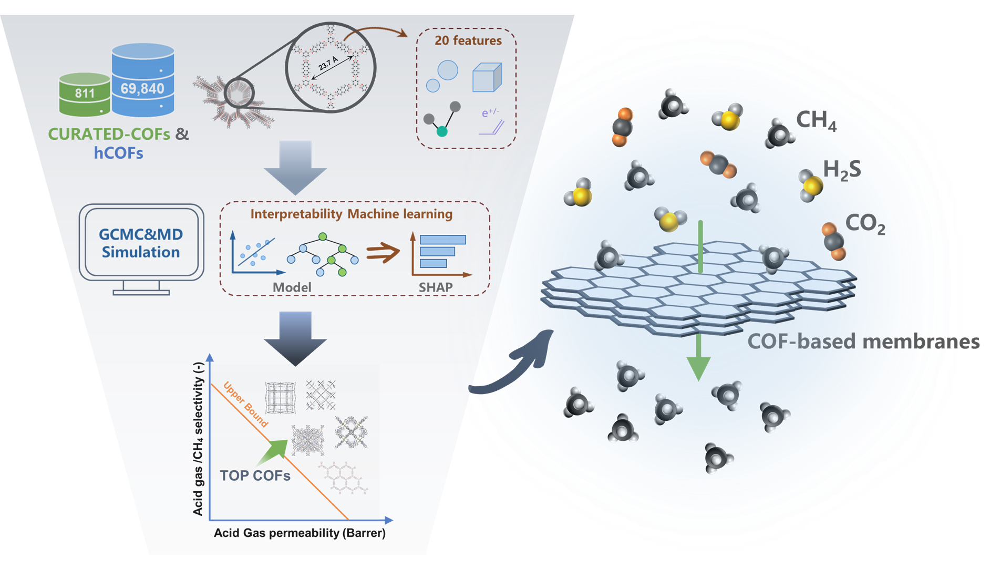

# COFsMembraneML
A machine learning implementation of an interpretable model for membrane separation performance prediction of COFs materials.If the code or molecular simulation data of this work is helpful to you，please do not hesitate to cite this paper:  ["Combining interpretable machine learning and molecular simulation to advance the discovery of COF-based membrane for acid gas separation"](https://doi.org/10.1021/acs.iecr.4c00855).



## Installation

Clone this repository；

```
git clone https://github.com/Xinbingru/COFsMembraneML.git
```

To run the code in this repository, you can create a conda environment from here.

```
cd ./COFsMembraneML
conda create -n CMM python=3.7.16
conda activate CMM
```

Install the dependencies:

```
conda install --file=COFsMembranesML_env.txt
```

or

```
pip install -r COFsMembranesML_env.txt
```

## Run

The machine learning tool used in this study is TPOT. TPOT is an automated machine learning tool for Python that optimizes machine learning pipelines using genetic programming. You can learn more about it in https://github.com/EpistasisLab/tpot.git

Running the `run.py` file directly generates the best machine learning prediction model for the task.

```
python run.py
```

## Predict

For each prediction task, the trained model `.pkl` file has been stored in the `/predict` folder, and the `predict.py` program was run to predict gas adsorption, diffusivity, and gas permeability for 14,956 cCOFs.

```
python predict.py
```

## SHAP analysis

Using the saved model, the SHAP values of the model can be extracted to interpret the trained ML model. 

Go into the `/SHAP` file and run Jupyter notebook file (e.g. `CH4_ads.ipynb`) directly to see the details.

